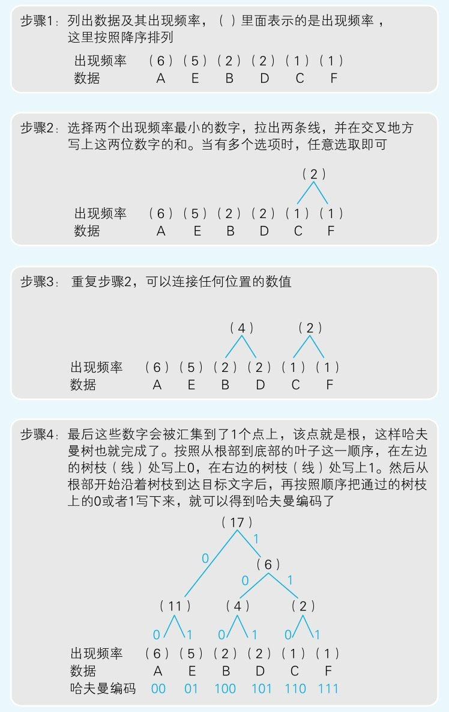

- [哈夫曼树是如何构建的？](#哈夫曼树是如何构建的)
    - [字符在计算机中的存在形式](#字符在计算机中的存在形式)
    - [哈夫曼编码是用来干什么的？](#哈夫曼编码是用来干什么的)
    - [哈夫曼编码是如何实现压缩的呢？](#哈夫曼编码是如何实现压缩的呢)
    - [构建哈夫曼树](#构建哈夫曼树)
    - [计算哈夫曼编码（~~Todo, 夜已深, 先睡觉了, 醒后更新~~，2022/05/18 done）](#计算哈夫曼编码todo-夜已深-先睡觉了-醒后更新20220518-done)
    - [简单示例](#简单示例)
    - [避免浪费](#避免浪费)
    - [运行结果](#运行结果)
    - [碎碎话](#碎碎话)

# 哈夫曼树是如何构建的？

今天在《程序是怎样跑起来的》一书中提及了哈夫曼编码的构建过程。突然回忆起第一次接触哈夫曼编码还是两年前的大一，那时连二叉树都不懂，更别提什么哈夫曼编码了。但是如今看了书中的构建思路，我已经有了大致的代码实现思路，立刻趁着思绪泉涌，赶紧打开vscode，把脑子里的构象一步步的敲下来。完成之后，运行调试，符合预期，大喜，欣欣然~

趁着兴奋的状态还未消去，赶紧写下此篇文章，以加深记忆。

### 字符在计算机中的存在形式

我们都知道，一个半角字符占用一个字节(byte)，也就是8比特(bit)。一个全角字符占用2个字节。（一个汉字为一个全角）

> 
>
> *《程序是怎样跑起来的》图6-1*

那么数据压缩本质是什么？其实就是减少重复数据。压缩效率越高，意味着对重复数据的利用率也越高。

那么，

### 哈夫曼编码是用来干什么的？

它也是一种压缩算法。

### 哈夫曼编码是如何实现压缩的呢？

数据中出现数据重复度最高字符（即出现频率高）的我们选用一种长度尽可能短的编码替换，字符重复度低（即出现频率低）则选用长度较长的编码替换。由于出现频率高的字符都使用了短编码，频率低的字符选用较长的编码。那么显而易见，如此处理后的数据占据空间会比原数据的空间要小，也就实现了数据压缩。

### 构建哈夫曼树

> 
>
> *《程序是怎样跑起来的》图6-5 哈夫曼树的编码顺序*

大致步骤书中已给出，但图中最终构建的哈夫曼树与我自己的程序构建的略有不同，若要实现图中的树结构，似乎还需要进行一些状态压缩处理，但我的算法属于其简化版，并没有状态压缩部分的内容，但对于理解哈夫曼编码的目的应该达到了。

接下来我们看看如何编码。

既然需要得知字符串的出现频率（比较出现次数即可），那么自然需要统出除各个字符在字符串中出现的次数。

以字符串`string s = "AAAAAABBCDDEEEEEF";`为例。

我们使用一个哈希表`map<char, int> table;`来记录各个字符在`s`出现的次数。

通过遍历`s`，我们可以得到`table`数据如下：

| 字符 | A   | B   | C   | D   | E   | F   |
| ---- | --- | --- | --- | --- | --- | --- |
| 频数 | 6   | 2   | 1   | 2   | 5   | 1   |

书中提到了需要将`table`按频数进行排序。

由于书中步骤二每一次都需要选出两个频率最小的数，在两数合并成一个数后有需要回到其队列。

那么我们不妨使用优先队列来模拟这样的操作。根据优先队列的性质，每一次将元素入队，优先队列都会按照其元素权重放入其应该放入的位置。如此一来，我们避免了每次都需要用手动排序来保证元素顺序，只需要处理入队出队即可。

我们约定了一个`TreeNode`对象来描述哈夫曼树结点：

```C++
class TreeNode {
public:
    int weight; // 字符权重
    char data; // 字符
    TreeNode* left;
    TreeNode* right;
    TreeNode(int weight, char data) {
        this->weight = weight;
        this->data = data;
        this->left = nullptr;
        this->right = nullptr;
    }

    TreeNode(int weight, char data, TreeNode* left, TreeNode* right) {
        this->weight = weight;
        this->data = data;
        this->left = left;
        this->right = right;
    }

    ~TreeNode() {
        cout << "TreeNode -> weight: " <<  this->weight << " has been released." << endl;
    }

};
```

以下就是构建哈夫曼树的核心代码`build`。

```C++
// 优先队列自定义排序，权重高的向后排（优先队列默认权重越高越前，为了其权重越低越在前，所以这里反了过来使用了>）
struct cmp {
    bool operator()(TreeNode* a, TreeNode* b) {
        return a->weight > b->weight;
    }
};
TreeNode* build(string& s) {
    // 构造一颗哈夫曼数
    // 首先需要统计字符串出现的次数
    map<char, int> _map;
    for (char& c : s) _map[c]++;
    // 使用一个优先队列来维护权值的位置关系，
    priority_queue<TreeNode*, vector<TreeNode*>, cmp> que;
    // 将每个元素构建成TreeNode，进行入队
    for (auto& pack : _map) {
        int data = pack.first;
        char val = pack.second;
        que.push(new TreeNode(val, data));
    }
    // 自底向上构造哈夫曼树，每次合并都会减少队列中的一个元素（2个元素合并成1个元素），当优先队列仅剩一个元素时，此时这个元素就是哈夫曼树的根节点
    while (que.size() > 1) {
        TreeNode* node1 = que.top();
        que.pop();
        TreeNode* node2 = que.top();
        que.pop();
        int weight = node1->weight + node2->weight;
        // 每一次合并，都构建一个新的TreeNode，并将用于合并的两个结点作为其左右子树，合并后的TreeNode使用 '\0' 区分
        que.push(new TreeNode(weight, '\0', node1, node2));
    }
    // 返回哈夫曼根节点
    return que.top();
}

```


这样，一颗哈夫曼树就构建完成了，可是单单构建还不够，我们需要利用这颗哈夫曼树得出哈夫曼编码。

我们都知道，哈夫曼树只需要统一在左右子树的树枝上标记0、1，然后从根节点一路向下进行标记，路径一直记录到叶子结点，那么这个路径即为当前字符的哈夫曼编码。

如图（绿色代表合成结点，蓝色代表原生的字符结点，蓝色底部文字代表其对应的哈夫曼编码，很显然，字符结点均为叶子结点）：


所以，我们要如何才能计算出哈夫曼编码呢？

### 计算哈夫曼编码（~~Todo, 夜已深, 先睡觉了, 醒后更新~~，2022/05/18 done）

我们已经知道，哈夫曼编码是由其0、1映射成的路径构成。我们要获得其字符的哈夫曼编码，就需要通过遍历这个哈夫曼树实现。

既然是遍历二叉树，那很自然的想到二叉树有三种经典的遍历方式，分别树前、中、后序遍历。但其实这里无所谓哪种方式，都是可行的。

这里我用的是前序遍历的方式，使用递归调用实现。

我们假定该函数名为`dfs`。

我们需要给递归函数提供哪些参数？

- `TreeNode* node`，毫无疑问，遍历二叉树自然需要提供结点参数，即`node`。

- `string path`，我们需要得到叶子结点的哈夫曼编码，也就是需要记录根节点到其叶子结点的访问路径。那么需要一个额外参数`path`来记录访问路径。
- `map<char, string>& huffman_code_table`，我们需要有一个哈希表`huffman_code_table`来记录字符对应的编码。

那么函数签名应为`void dfs(TreeNode* node, string path，map<char, string>& huffman_code_table)`。

那么如何递归呢？

第一步，需要给递归函数一个`base case`，即终止递归的条件。当`node`为`nullptr`时自然就不需要继续递归了。

```C++
void dfs(TreeNode* node, string path，map<char, string>& huffman_code_table) {
  if (!node) return;
  /** pass */
}
```

第二步，若当前结点是叶子结点时，也就意味着当前的`node`就是字符所在的结点。那么我们就要在编码表`huffman_code_table`中，将`path`与字符`node->data`建立起映射关系了。

```C++
void dfs(TreeNode* node, string path，map<char, string>& huffman_code_table) {
  if (!node) return;
  if (!node->left && !node->right) {
    huffman_code_table[node->data] = path;
    return;
  }
  /** pass */
}
```

第三步，如果`node`不为`nullptr`，且`node->left`或者`node->right`不为`nullptr`，这意味着`node`不是叶子结点，意味着它们是路径上的结点。所以我们需要往其左右结点继续向下搜索，并且在搜索的同时记录当前的路径。进行递归搜索。

```C++
void dfs(TreeNode* node, string path，map<char, string>& huffman_code_table) {
  if (!node) return;
  if (!node->left && !node->right) {
    huffman_code_table[node->data] = path;
    return;
  }
  dfs(node->left, path + "0");
  dfs(node->right, path + "1");
}
```

如此，`dfs`就算写完了，当`dfs`接受到哈夫曼树的头结点后，它就会不断的搜索、记录路径，一旦遇到字符所在结点，就开始建立字符与编码的映射关系。

由于`dfs`是一个递归函数，我们需要创建一个额外的函数`generate_huffman_code`并且借助之前写好的`build`调用它。

```C++
map<char, string> generate_huffman_code(string& s) {
    map<char, string> huffman_code_table;
  	// 根据s构建哈夫曼树
    TreeNode* root = build(s);
    // 对哈夫曼树进行深度遍历构建哈夫曼编码
    dfs(root, "", huffman_code_table);
  	// 返回哈夫曼编码映射表
    return huffman_code_table;
}
```


以上操作一番后，我们就完成了哈夫曼树的构建与哈夫曼编码表的构建。一个伟大的数据压缩算法就得以实现了！

现在你可以运行以下示例，看其结果是否与以上所说的一致。

### 简单示例

```C++
//
// Created by 野漫横江 on 2022/5/17.
//
#include <iostream>
#include <map>
#include <vector>
#include <queue>
#include <utility>
using namespace std;
class TreeNode {
public:
    int weight;
    char data;
    TreeNode* left;
    TreeNode* right;
    TreeNode(int weight, char data) {
        this->weight = weight;
        this->data = data;
        this->left = nullptr;
        this->right = nullptr;
    }

    TreeNode(int weight, char data, TreeNode* left, TreeNode* right) {
        this->weight = weight;
        this->data = data;
        this->left = left;
        this->right = right;
    }

    ~TreeNode() {
        cout << "TreeNode -> weight: " <<  this->weight << " has been released." << endl;
    }

};
// 优先队列自定义排序，权重高的向后排
struct cmp {
    bool operator()(TreeNode* a, TreeNode* b) {
        return a->weight >= b->weight;
    }
};
/**
 * 输出哈希表key，val到终端，用于调试
 * @tparam K
 * @tparam V
 * @param map
 */
template <typename K, typename V>
void log_map(map<K, V>& _map) {
    for (auto& packet : _map) {
        cout << "key: " << packet.first << ", val: " << packet.second << endl;
    }
}
/**
 * 构建哈夫曼树
 * @param s
 * @return
 */
TreeNode* build(string& s) {
    // 构造一颗哈夫曼数
    // 首先需要统计字符串出现的次数
    map<char, int> _map;
    for (char& c : s) _map[c]++;
    // 使用一个优先队列来维护权值的位置关系，
    priority_queue<TreeNode*, vector<TreeNode*>, cmp> que;
    for (auto& pack : _map) {
        int data = pack.first;
        char val = pack.second;
        que.push(new TreeNode(val, data));
    }
    // 自底向上构造哈夫曼树
    while (que.size() > 1) {
        TreeNode* node1 = que.top();
        que.pop();
        TreeNode* node2 = que.top();
        que.pop();
        int weight = node1->weight + node2->weight;
        // 合并后的TreeNode使用 '\0' 区分
        que.push(new TreeNode(weight, '\0', node1, node2));
    }
    // 返回哈夫曼根节点
    return que.top();
}

void dfs(TreeNode* node, string path, map<char, string>& huffman_code_table) {
    if (!node) return;
    if (!node->left && !node->right) {
        huffman_code_table[node->data] = path;
        return;
    }
    dfs(node->left, path + "0", huffman_code_table);
    dfs(node->right, path + "1", huffman_code_table);
}
/**
 * 对哈夫曼树进行深度遍历构建哈夫曼编码
 * @param root 哈夫曼树根节点
 * @return 返回编码表
 */
map<char, string> generate_huffman_code(string& s) {
    map<char, string> huffman_code_table;
    TreeNode* root = build(s);
    // 对哈夫曼树进行深度遍历构建哈夫曼编码
    dfs(root, "", huffman_code_table);
    return huffman_code_table;
}

int main() {
    string s = "AAAAAABBCDDEEEEEF";
    map<char, string> table = generate_huffman_code(s);
    // 输出哈夫曼编码结果
    log_map(table);
    return 0;
}
```

### 避免浪费

运行完示例后，你应该注意到了使用`new`申请到的内存似乎并没有被释放掉。

显然这是不负责任的行为。

所以，在我们使用`dfs`构建出`huffman_code_table`之后，应该要手动将我们亲手创建出来的整颗哈夫曼树所占据的内存释放掉。

将一整颗哈夫曼树内存释放，也就是需要遍历一整颗哈夫曼树。

我需要怎样遍历？写代码的时候我在这个问题上有些疑问。

如果我采用先序遍历。

```C++
void release_tree_node_memory(TreeNode* root) {
    if (!root) return;
    delete root;
    release_tree_node_memory(root->left);
    release_tree_node_memory(root->right);
}
```


显然，释放掉`node`后，那么`node`数据已经不存在，我就没有办法获取到`node->left`与`node->right`指针指向的内存空间，也就无法释放`node->left`与`node->right`内存空间中的内存了。

如果我采用中序遍历。

```C++
void release_tree_node_memory(TreeNode* root) {
    if (!root) return;
    release_tree_node_memory(root->left);
    delete root;
    release_tree_node_memory(root->right);
}
```

精确释放了哈夫曼树所有左子数内存，保留右子数。（保左不保右，代码写的非常好，下次不要再写了）

如果我采用后序遍历。

```C++
void release_tree_node_memory(TreeNode* root) {
    if (!root) return;
    release_tree_node_memory(root->left);
    release_tree_node_memory(root->right);
    delete root;
}
```

芜湖！自底向上释放了一整颗二叉树！大工告成，✌️！

```C++
//
// Created by 野漫横江 on 2022/5/17.
//
#include <iostream>
#include <map>
#include <vector>
#include <queue>
#include <utility>
using namespace std;
class TreeNode {
public:
    int weight;
    char data;
    TreeNode* left;
    TreeNode* right;
    TreeNode(int weight, char data) {
        this->weight = weight;
        this->data = data;
        this->left = nullptr;
        this->right = nullptr;
    }

    TreeNode(int weight, char data, TreeNode* left, TreeNode* right) {
        this->weight = weight;
        this->data = data;
        this->left = left;
        this->right = right;
    }

    ~TreeNode() {
        cout << "TreeNode -> weight: " <<  this->weight << " has been released." << endl;
    }

};
// 优先队列自定义排序，权重高的向后排
struct cmp {
    bool operator()(TreeNode* a, TreeNode* b) {
        return a->weight >= b->weight;
    }
};
/**
 * 输出哈希表key，val到终端，用于调试
 * @tparam K
 * @tparam V
 * @param map
 */
template <typename K, typename V>
void log_map(map<K, V>& _map) {
    for (auto& packet : _map) {
        cout << "key: " << packet.first << ", val: " << packet.second << endl;
    }
}
/**
 * 自底向上释放TreeNode的内存空间
 * @param root
 */
void release_tree_node_memory(TreeNode* root) {
    if (!root) return;
    release_tree_node_memory(root->left);
    release_tree_node_memory(root->right);
    delete root;
}
/**
 * 构建哈夫曼树
 * @param s
 * @return
 */
TreeNode* build(string& s) {
    // 构造一颗哈夫曼数
    // 首先需要统计字符串出现的次数
    map<char, int> _map;
    for (char& c : s) _map[c]++;
    // 使用一个优先队列来维护权值的位置关系，
    priority_queue<TreeNode*, vector<TreeNode*>, cmp> que;
    for (auto& pack : _map) {
        int data = pack.first;
        char val = pack.second;
        que.push(new TreeNode(val, data));
    }
    // 自底向上构造哈夫曼树
    while (que.size() > 1) {
        TreeNode* node1 = que.top();
        que.pop();
        TreeNode* node2 = que.top();
        que.pop();
        int weight = node1->weight + node2->weight;
        // 合并后的TreeNode使用 '\0' 区分
        que.push(new TreeNode(weight, '\0', node1, node2));
    }
    // 返回哈夫曼根节点
    return que.top();
}

void dfs(TreeNode* node, string path, map<char, string>& huffman_code_table) {
    if (!node) return;
    if (!node->left && !node->right) {
        huffman_code_table[node->data] = path;
        return;
    }
    dfs(node->left, path + "0", huffman_code_table);
    dfs(node->right, path + "1", huffman_code_table);
}
/**
 * 对哈夫曼树进行深度遍历构建哈夫曼编码
 * @param root 哈夫曼树根节点
 * @return 返回编码表
 */
map<char, string> generate_huffman_code(string& s) {
    map<char, string> huffman_code_table;
    TreeNode* root = build(s);
    // 对哈夫曼树进行深度遍历构建哈夫曼编码
    dfs(root, "", huffman_code_table);
    release_tree_node_memory(root); // 将root所引用的所用指针指向的内存空间全部释放
    return huffman_code_table;
}

int main() {
    string s = "AAAAAABBCDDEEEEEF";
    map<char, string> table = generate_huffman_code(s);
    // 输出哈夫曼编码结果
    log_map(table);
    return 0;
}
```

### 运行结果

```
TreeNode -> weight: 6 has been released.
TreeNode -> weight: 5 has been released.
TreeNode -> weight: 2 has been released.
TreeNode -> weight: 1 has been released.
TreeNode -> weight: 1 has been released.
TreeNode -> weight: 2 has been released.
TreeNode -> weight: 2 has been released.
TreeNode -> weight: 4 has been released.
TreeNode -> weight: 6 has been released.
TreeNode -> weight: 11 has been released.
TreeNode -> weight: 17 has been released.
key: A, val: 0
key: B, val: 110
key: C, val: 11101
key: D, val: 1111
key: E, val: 10
key: F, val: 11100

```

### 碎碎话

这篇文章用了两天时间完成。

今天在超算上装klayout，由于没有root权限，所以只好clone 源码进行编译安装，没想到居然能编译4个小时，一下午天都黑了，漫长的等待，于是一边写文章，一边看编译是否完成。

没想到文章还没写完，最担心的事情还是发生了，它居然报错了...心中五味杂陈，成年人的崩溃就在一瞬间，一时间难以接受这样的事实。只好先把这篇写完，再去尝试问题如何解决。痛，实在太痛了！

写到这里就结束了，但还想再罗嗦一句。

> `cmake`，🐶都不用！
>
> *——class-undefined*

*2022年5月18日 于寝室 被环境配置折磨 奄奄然*


